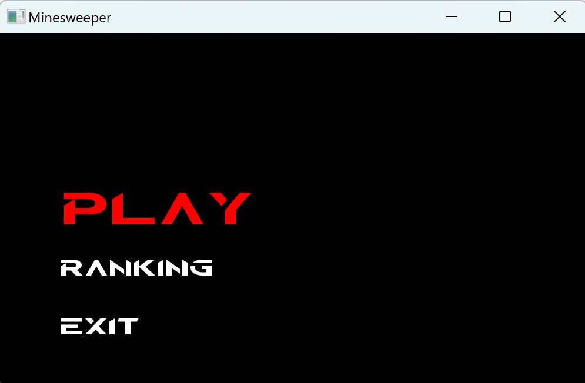

# PROIekt

## Name
Saper

## Description
Saper to logiczna gra komputerowa, która wymaga umiejętności dedukcyjnych oraz spostrzegawczości. Gracz musi odkryć pola na planszy, unikając min, które są ukryte wśród nich. Każde odkrycie pola dostarcza informacji na temat liczby min znajdujących się w jego sąsiedztwie, dzięki czemu gracz może wykonać dedukcje i odkryć bezpieczne pola. Gra saper wymaga strategii oraz podejmowania ryzykownych decyzji, a jej dynamiczny charakter i losowe rozmieszczenie min sprawiają, że każda gra jest unikalnym wyzwaniem.

## How to play
Jeśli chcesz zagrać, musisz:

-> stworzyć projekt w edytorze kodu c++ i dodać
    tam pliki (zalecamy Visual Studio)

-> skonfigurować bibliotekę SFML

## Authors and acknowledgment
Tomasz Zalewski, Igor Płoszaj, Antoni Kowalski grupa 102 poniedziałek 16:15

## Division of Work
Tomasz Zalewski - responsble for Class Cell and Class GameInterface
Igor Płoszaj - responsble for Class MenuElement
Antoni Kowalski - responsble for Class Player and Class Board

## Usage
1. Pierwsze menu wygląda następująco:

Należy wpisać nick swojego gracza aby przejść dalej.
2. Następnie dostanie się takie menu:

Tutaj do wyboru mamy trzy przyciski między którymi zmieniamy strzałkami i zatwierdzamy enterem. Kiedy wciśnie się przycisk pod tytułem ranking dostaniemy to co pokazane poniżej.
3. Menu rankingowe:

Przedstawione menu pokazuje wyniki graczy na każdej z trudności. Aby zmieniać między trudnościami używa się strzałek poziomych.
4. Menu Play:

To menu jest wyświetlane po wcisnięciu przycisku Play. Należy tutaj wybrać czy rozpocząć nową grę czy otworzyć poprzednio zapisaną. Jeśli wybierze się nowa gra pokaże się kolejne menu.
5. Menu z trudnościami:

Po wyborze trudności zaczyna się właściwa gra.
6. Gra

Tak wygląda interface podczas gry.

## Milestones
week
1 Struktury Klas
2 Działające Klasy
3 Działająca gra
4 Dodanie rankingu oraz poprawianie błędów

## Meetings
We wtorki

## Classes
1. Klasa GameInetrface - odpowiada za ogólną logikę gry i połączenie z interfejsem użytkownika.
2. Klasa Board - reprezentuje planszę gry i przechowuje informacje o minach oraz otwartych polach.
3. Klasa Cell - reprezentuje pojedyncze pole na planszy i przechowuje informacje o swoim stanie oraz liczbie min sąsiadujących pól.
    Flag
    Mine
    Number
    Covered
4. Klasa MenuElement - odpowiada za menu główne gry.
    ChooseGameMenu
    ChooseGamemodeMenu
    nameInputWindow
    Ranking
    RankingHUD
    StartMenu
